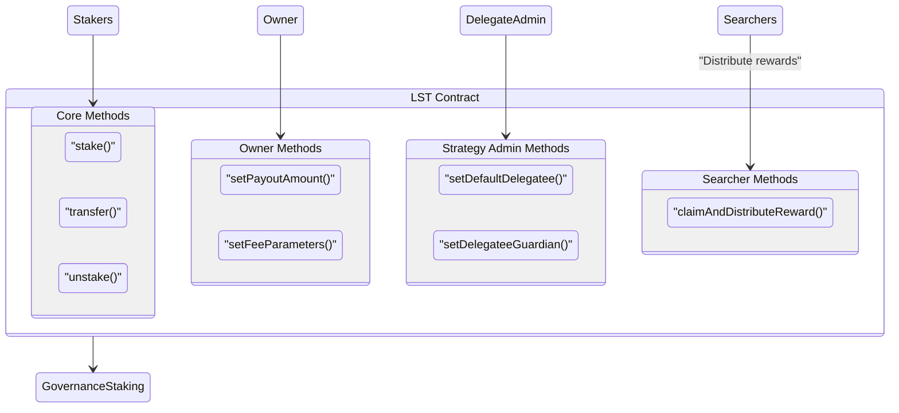

# stGOV

stGOV is a convenient liquid token wrapper on top of [Staker](https://github.com/withtally/staker). Governance token holders can stake their tokens for stGOV. stGOV automates claiming rewards and delegating governance power. It's like what stETH does for ETH staking.

## How it works

- Stake governance tokens to receive `stGOV` LST tokens.
- Optionally, delegate the governance token voting power
- The `stGOV` contracts deposit the governance tokens in Staker. `stGOV` assigns the voting power to the holder's chosen delegate, if any. Otherwise, it assigns the voting power using the default delegation strategy
- The delegation strategy can be configured by governance. This keeps the default voting power aligned with the DAO and mitigates capture risk.
- The `stGOV` contract claims Staker's rewards regularly.
- The rewards are auctioned off for more of the governance token, which is added to each user's staked position. e.g. a deposit worth 100 GOV tokens might grow to be worth 105 GOV tokens.

Holders can redeem their liquid staking tokens for the underlying governance token at any time.

For further documentation, see [Tally's docs](https://docs.tally.xyz/knowledge-base/staking-on-tally).



## Contracts

Each deployment of stGOV consists of two ERC-20 tokens that distribute rewards through the same underlying accounting system.

* [src/GovLst.sol](src/GovLst.sol) - Implements a *rebasing* style liquid staking token similar to stETH. One LST token is worth one of the underlying staked token, and each user's balance is updated dynamically.
* [src/FixedGovLst.sol](src/FixedGovLst.sol) - Implements a *fixed balance* vault-style staking token. A user's balance *does not change*, but also *does not* map 1:1 with the underlying staked token. Instead, the number of underlying tokens a user may claim in exchange for their position goes up over time.

Each deployment of the stGOV system includes both style of tokens, but a project may choose to emphasize one or the other, or to put both front and center for their users. Generally, fixed balance tokens are preferred by integrators and custody providers, and tend to be favored for this reason.

In addition to the two token contracts, each stGOV deployment also includes an additional contract for enforcing (optional) withdrawal delays:

* [src/WithdrawGate.sol](src/WithdrawGate.sol) - A contract which enforces an optional withdrawal delay that can be configured by the LST owner. The withdrawal delay mechanism can be used to prevent reward frontrunning behavior, if it is observed. Reward frontrunning is not profitable if gas costs are non-negligible, but if it is observed, a short withdrawal delay can be imposed to ensure it is a negative EV strategy.

The repository also contains various extensions and peripheral contracts that can be used optionally by projects adopting stGOV. These included:

* [src/extensions/GovLstOnBehalf.sol](src/extensions/GovLstOnBehalf.sol) & [src/extensions/FixedGovLstOnBehalf.sol](src/extensions/FixedGovLstOnBehalf.sol) - Extensions to the LST contracts that enable signature based execution of staking operations.
* [src/extensions/GovLstPermitAndStake.sol](src/extensions/GovLstPermitAndStake.sol) & [src/extensions/FixedGovLstPermitAndStake.sol](src/extensions/FixedGovLstPermitAndStake.sol) - Extensions to the LST contracts that provide convenience methods for staking operations that use signatures for token approvals. To use these extensions, the underlying staking token must support ERC-2612 permit functionality.
* [src/auto-delegates/OverwhelmingSupportAutoDelegate.sol](src/auto-delegates/OverwhelmingSupportAutoDelegate.sol) - An automated delegate contract that projects can optionally use as the "default delegatee" of their stGOV deployment. This contract votes only on proposals that have a high degree of support from other delegates, but has not yet reached quorum.

## Usage

The stGOV repository is designed to be used as a library. Once added to your project, it can be used to assemble, configure, and deploy an instance of stGOV appropriate for your project.

### Installation

#### Foundry

Add stGOV as a dependency:

```bash
forge install withtally/stGOV
```

#### Hardhat

🚧 Coming Soon.

Usage of stGOV in Hardhat is not yet supported, but will be soon.

### Import and Assemble stGOV

To create a concrete implementation of stGOV, you must create concrete instances of both `GovLst` and `FixedGovLst`. The former deploys the latter during its own deployment.

To do this, first import `FixedLstGOV` and the desired extensions. Create a new contract that inherits from `FixedGovLst` and the extensions of choice, and implement the constructor, along with any method overrides in accordance with your desired set of features and customizations.

```solidity
pragma solidity 0.8.28;

import {FixedGovLst, IERC20} from "stGOV/FixedGovLst.sol";
import {FixedGovLstPermitAndStake} from "stGOV/extensions/FixedGovLstPermitAndStake.sol";
import {FixedGovLstOnBehalf} from "stGOV/extensions/FixedGovLstOnBehalf.sol";
import {GovLst} from "stGOV/GovLst.sol";

contract FixedMyProjectLst is FixedGovLst, FixedGovLstPermitAndStake, FixedGovLstOnBehalf {
  constructor(
    string memory _name,
    string memory _symbol,
    string memory _version,
    GovLst _lst,
    IERC20 _stakeToken,
    uint256 _shareScaleFactor
  ) FixedGovLst(_name, _symbol, _version, _lst, _stakeToken, _shareScaleFactor) {}
}
```

Next, import `GovLst` and desired extensions. Create another new contract that inherits from `GovLst` and the extensions of choice, implement the constructor *and* the `_deployFixedGovLst`, a virtual method that is called in the `GovLst` to deploy your concrete `FixedGovLst` implementation.

```solidity
pragma solidity 0.8.28;

import {GovLst, IERC20} from "stGOV/GovLst.sol";
import {GovLstPermitAndStake} from "stGOV/extensions/GovLstPermitAndStake.sol";
import {GovLstOnBehalf} from "stGOV/extensions/GovLstOnBehalf.sol";
import {FixedGovLst} from "stGOV/FixedGovLst.sol";
import {FixedMyProjectLst} from "src/FixedMyProjectLst.sol";

contract MyProjectLst is GovLst, GovLstPermitAndStake, GovLstOnBehalf {
  constructor(GovLst.ConstructorParams memory _params) GovLst(_params) {}

  function _deployFixedGovLst(
    string memory _name,
    string memory _symbol,
    string memory _version,
    GovLst _lst,
    IERC20 _stakeToken,
    uint256 _shareScaleFactor
  ) internal virtual override returns (FixedGovLst _fixedLst) {
    return new FixedMyProjectLst(_name, _symbol, _version, _lst, _stakeToken, _shareScaleFactor);
  }
}
```

### Testing

Foundry users can also import test-related contracts into their own tests if desired:

```solidity
pragma solidity 0.8.28;

import {GovLstTest} from "stGOV-test/GovLst.t.sol";

contract MyGovLstTest is GovLstTest {
    // ... Your test implementations
}
```

## Development

These contracts were built and tested with care by the team at [ScopeLift](https://scopelift.co).

### Build and test

This project uses [Foundry](https://github.com/foundry-rs/foundry). Follow [these instructions](https://github.com/foundry-rs/foundry#installation) to install it.

Clone the repo.

Set up your .env file

```bash
cp .env.template .env
# edit the .env to fill in values
```

Install dependencies & run tests.

```bash
forge install
forge build
forge test
```

### Spec and lint

This project uses [scopelint](https://github.com/ScopeLift/scopelint) for linting and spec generation. Follow [these instructions](https://github.com/ScopeLift/scopelint?tab=readme-ov-file#installation) to install it.

To use scopelint's linting functionality, run:

```bash
scopelint check # check formatting
scopelint fmt # apply formatting changes
```

To use scopelint's spec generation functionality, run:

```bash
scopelint spec
```

This command will use the names of the contract's unit tests to generate a human readable spec. It will list each contract, its constituent functions, and the human readable description of functionality each unit test aims to assert.

### Gas Reports

To generate gas reports run the following command.

```bash
make gas
```

This will overwrite the gas report json, which can be checked in alongside changes to the core contracts to track impact on the gas used by important user actions.

Note that the gas report tests *must* be run with the `--isolate` flag in order to generate results that reflect reality.


## License

The code in this repository is licensed under the [MIT](LICENSE.txt) unless otherwise indicated.

Copyright (C) 2025 Tally