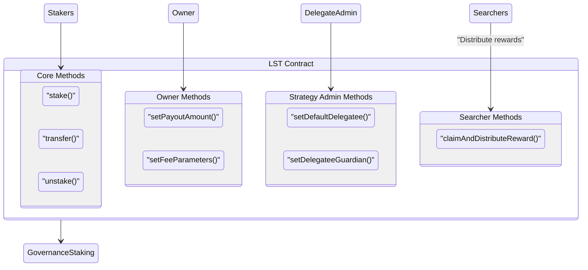

# stGOV

Staked Gov – `stGov` – is the easiest way to get rewards from Staker, a governance staking system.

stGov is a convenient liquid token wrapper on top of [Staker](https://github.com/withtally/staker). Governance token holders can stake their tokens for stGov. stGov automates claiming rewards and delegating governance power. It's like what stETH does for ETH staking.

## How it works

- Stake governance tokens to receive that many `stGov`.
- Optionally, delegate the governance token voting power
- The `stGov` contract deposits the governance tokens in staker. `stGov` assigns the voting power to the holder's chosen delegate, if any. Otherwise, it assigns the voting power using the default delegation strategy
- The delegation strategy can be configured by governance. This keeps the default voting power aligned with the DAO and mitigates capture risk.
- The `stGov` contract claims Staker's rewards daily.
- The rewards are auctioned off for more of the governance token, which is added to each user's staked position. e.g. a balance of `100 stGov` might grow to `100.5 stGov`.

Holders can redeem their `stGOV` 1:1 for the underlying governance token at any time.

For further documentation, see [Tally's docs](https://docs.tally.xyz/knowledge-base/staking-on-tally).



## Gas Reports

To generate gas reports run the following command.

```bash
make gas
```

This will overwrite the gas report json, which can be checked in alongside changes to the core contracts to track impact on the gas used by important user actions.

Note that the gas report tests *must* be run with the `--isolate` flag in order to generate results that reflect reality.
